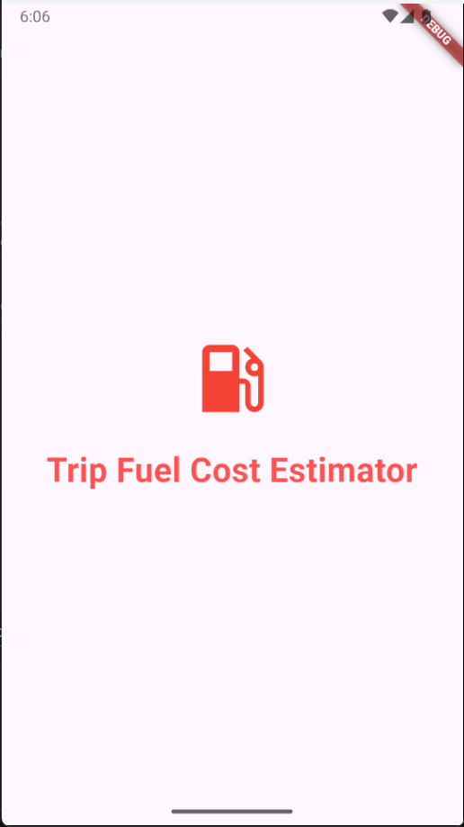
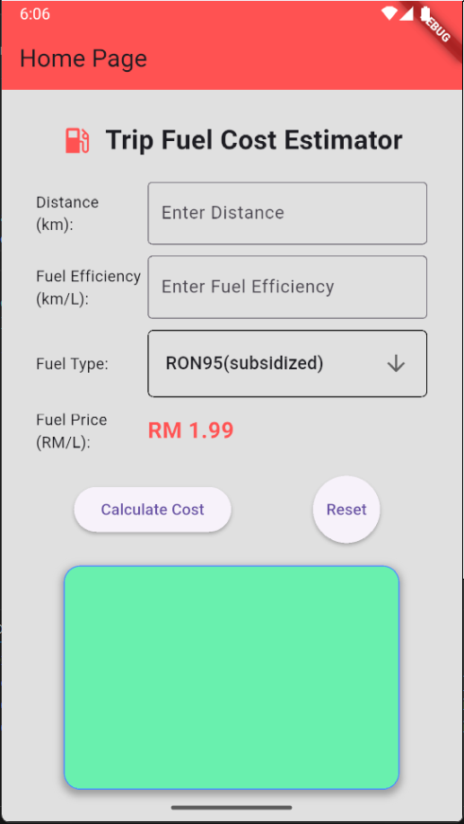
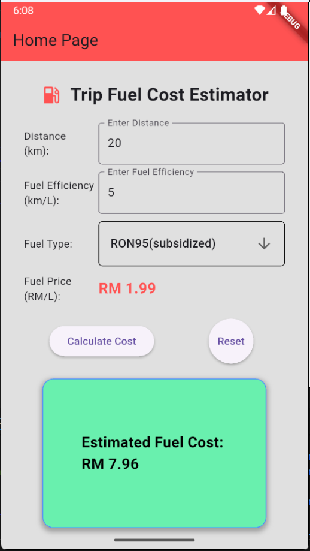

# Trip Fuel Cost Estimator
This is a simple Flutter application designed to estimate the fuel cost for a trip. Users input the trip distance in kilometers, their vehicle's fuel efficiency in km/L, and select the fuel type from a dropdown menu. The app then calculates and displays the estimated fuel cost in Malaysian Ringgit (RM) based on predefined fuel prices, with a splash screen for initial loading.

# Inputs → Process → Output
Inputs:
* Distance: Numeric value in kilometers (entered via TextField).
* Fuel Efficiency: Numeric value in km/L (entered via TextField).
* Fuel Type: Selected from a dropdown menu (options: RON95(subsidized), RON95, RON97, Diesel).

Process:
* Validate inputs: Ensure distance and efficiency are non-negative, and efficiency is not zero.
* Retrieve fuel price based on selected fuel type (hardcoded values: RON95(subsidized) = 1.99 RM/L, RON95 = 2.05 RM/L, RON97 = 3.14 RM/L, Diesel = 2.89 RM/L).
* Calculate fuel consumption: distance / efficiency.
* Compute estimated cost: fuel consumption * fuel price, rounded to two decimal places.

Output:
* Display the estimated fuel cost in RM within a styled container.
* Show error messages for invalid inputs (e.g., negative values or zero efficiency).

# Widgets Used
* Text: For displaying labels, titles, and output messages.
* TextField: For user input of distance and fuel efficiency.
* DropdownButton: For selecting the fuel type.
* ElevatedButton: For "Calculate Cost" and "Reset" actions.
* Row/Column: For layout structuring, such as aligning inputs and buttons horizontally/vertically.
* Container: For styling the output display box with borders, shadows, and padding.

# Basic Validation Approach
The app performs basic input validation in the calculateCost method:
* Checks if distance or efficiency are negative, displaying an error message if so.
* Checks if efficiency is zero to avoid division by zero, displaying a specific error.
* If distance is zero, it proceeds but shows a cost of 0.00 with a note.
* Uses double.tryParse to handle non-numeric inputs gracefully (defaults to 0.0).
* Updates the UI state with error flags to change text color and border for visual feedback.

# Authorship Note
(WEE JUN JEANG)

“I confirm that this project represents my own original work in accordance with academic integrity policies. No part of the code was fully generated by AI tools such as ChatGPT or GitHub Copilot. I relied solely on lecture notes, class tutorials, and official Flutter documentation. I understand that my work may be scrutinized, and if it is found that I did not personally develop the code, marks may be deducted, or the submission may be disqualified.”

# Screenshots
## 1. Splash Screen

---

## 2. Home Screen (Before Calculation)

---

## 3. Home Screen (Result)
